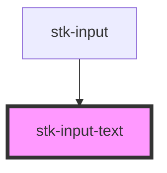

# stk-input-email

<!-- Auto Generated Below -->

## Properties

| Property       | Attribute       | Description | Type                                                | Default     |
| -------------- | --------------- | ----------- | --------------------------------------------------- | ----------- |
| `allowClear`   | `allow-clear`   |             | `boolean`                                           | `false`     |
| `defaultValue` | `default-value` |             | `string`                                            | `undefined` |
| `disabled`     | `disabled`      |             | `boolean`                                           | `false`     |
| `maxLength`    | `max-length`    |             | `number`                                            | `undefined` |
| `placeholder`  | `placeholder`   |             | `string`                                            | `undefined` |
| `validator`    | --              |             | `(string \| ValidatorEntry \| Validator<string>)[]` | `undefined` |
| `value`        | `value`         |             | `string`                                            | `undefined` |

## Events

| Event     | Description | Type                  |
| --------- | ----------- | --------------------- |
| `changed` |             | `CustomEvent<string>` |

## Dependencies

### Used by

 - [stk-input]()

### Graph

----------------------------------------------

*Built with [StencilJS](https://stenciljs.com/)*
